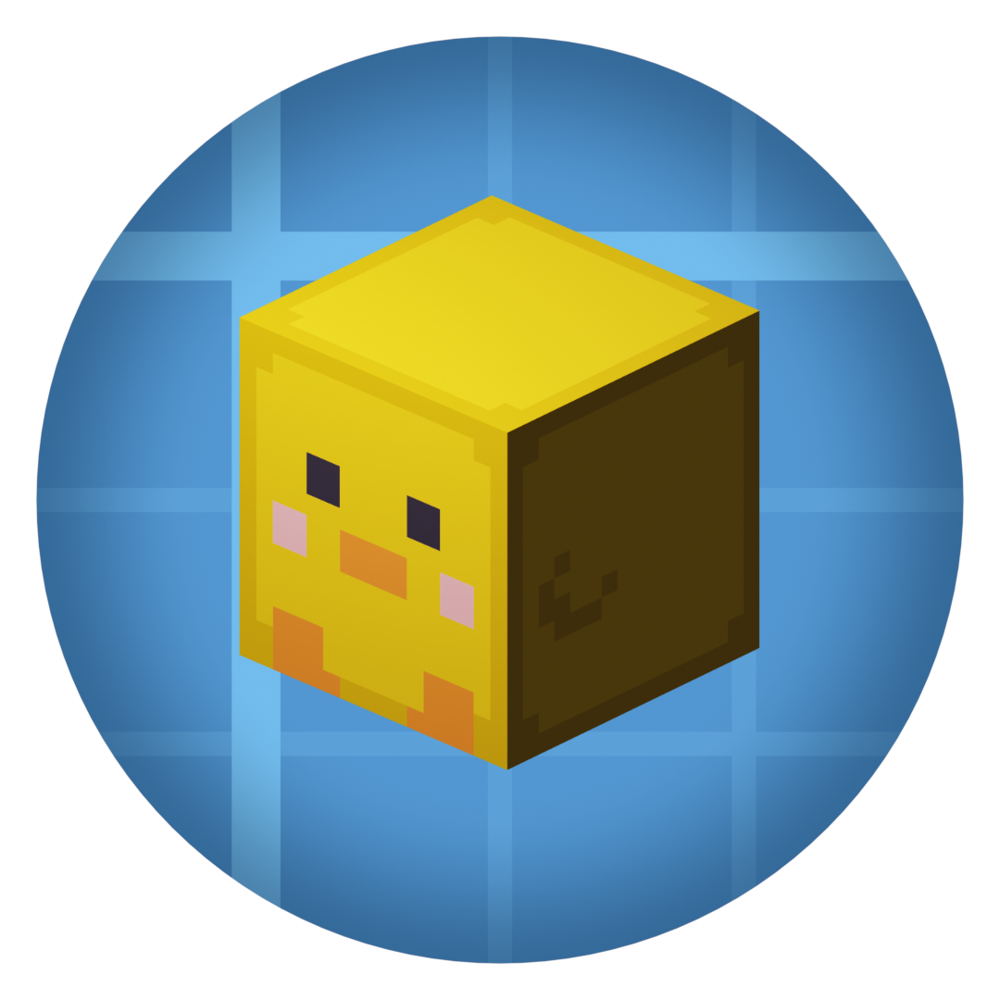

<h1 align="center">Create: Henry</h1>

  

Create addon for 1.20.1 (Fabric &amp; Forge) that adds quality-of-life machines, new fan processing, pressing, and a few treats.

<h2 align="center">Download</h2>

  
  

<h2 align="center">Features</h2>

<h3 align="center">Machines &amp; Kinetics</h3>

  Golden Mixer 
  Hydraulic Press 
  Industrial Fan 
  Furnace Engine &amp; Powered Flywheel 
  Kinetic Motor 
  Industrial Brake 
  Bore Block 
  Multimeter 
  Redstone Divider 
  Inverse Box

<h3 align="center">Logistics</h3>

  Smart Hopper 
  Roll Table 
  Fluid Hatch

<h3 align="center">Fan Processing</h3>

  Sanding 
  Freezing 
  Seething 
  Withering 
  Dragon Breathing

<h3 align="center">Pressing</h3>

  Hydraulic Compacting

<h3 align="center">Materials &amp; Drinks</h3>

  Rubber, Raw Rubber and their blocks 
  Sap 
  Coal Piece 
  Lapis Lazuli Shard 
  Kinetic Mechanism 
  Milkshakes: Chocolate, Vanilla, Strawberry, Glowberry, Pumpkin

<h3 align="center">Ponder Scenes</h3>

  In-game guides for the mod's machines and processes

<h2 align="center">Requirements</h2>

  Minecraft 1.20.1 
  Create 6.0.8+ 
  Forge 47.4.0+ (also available for Fabric)

<h2 align="center">About</h2>

  Create: Henry keeps Create's look and feel while adding quality-of-life machines, 
  new processing types, and a few extras that fit the base loop. 
  It is a continuation of the addon "Create: Dreams &amp; Desires" for 1.20.1, but is otherwise independent.

<h2 align="center">Disclaimer</h2>

  This addon has features inspired by Create: Dreams &amp; Desires by LopyLuna, 
  but has no affiliation or endorsement. Please don't bother LopyLuna about it.

<h2 align="center">License</h2>

  MIT

